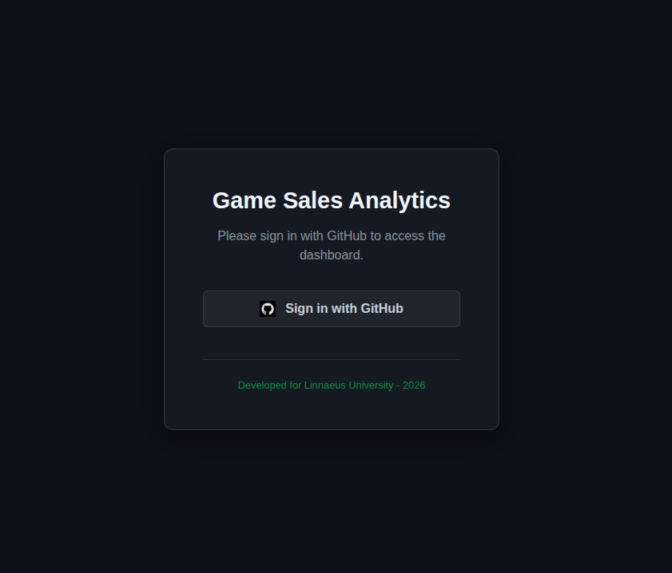
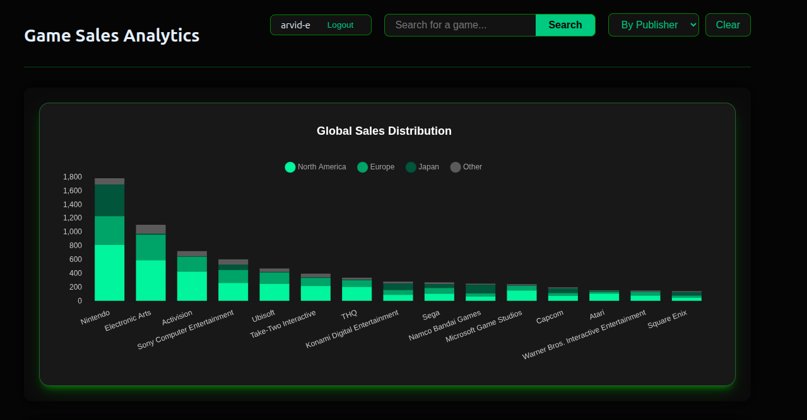
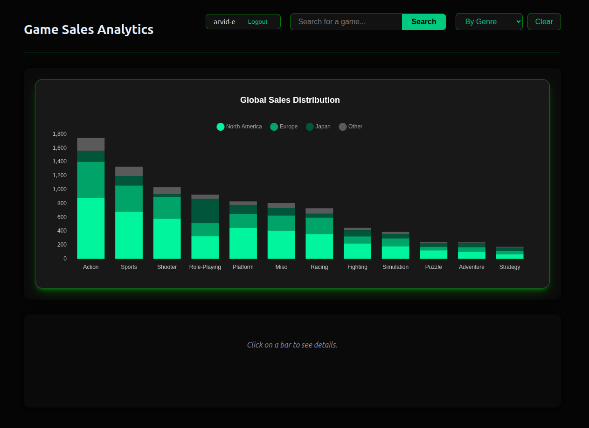
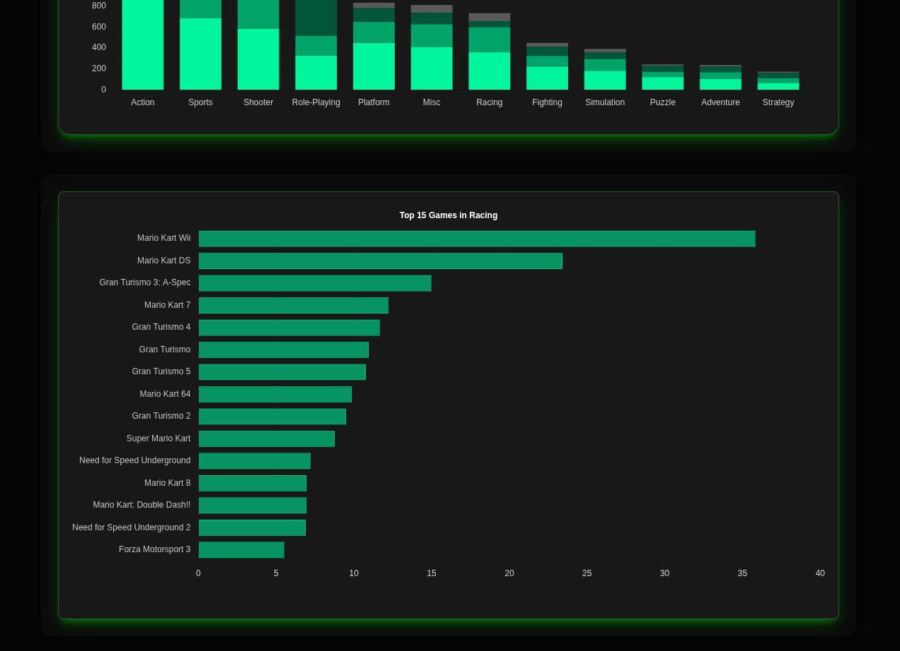
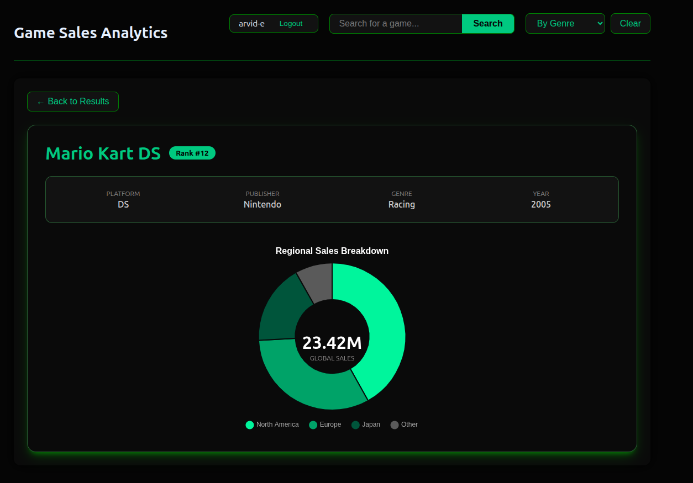
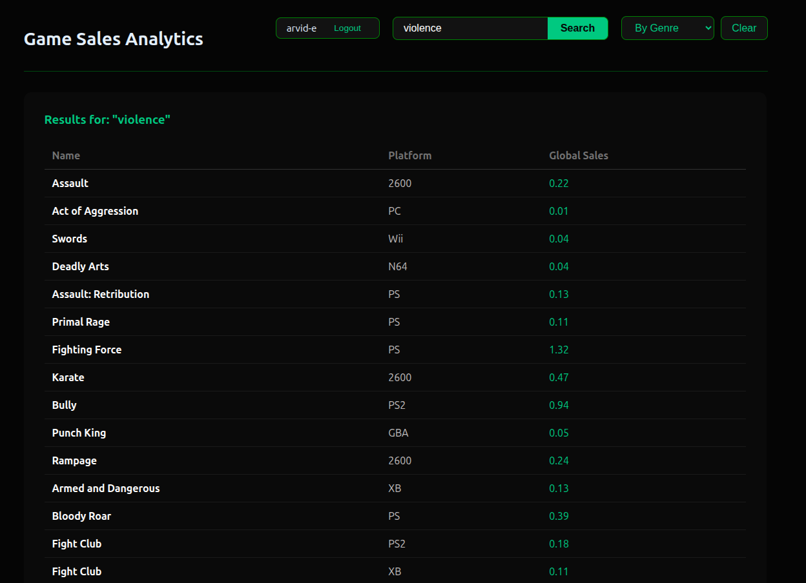

# Assignment WT - Web for Data Science

## Project Name

vg-sales-explorer

## Objective

Create a functional, visually engaging, and *interactive* data visualization web application that consumes the API you built in the previous assignment. The application must authenticate users via OAuth and be publicly accessible.

## Application Summary

This application provides an interactive visualization of video game sales data. It allows the user to view and browse a variety of sales metrics from an interactive dashboard. It provides an high level view of sales data sorted by genre, publisher or platform, where you also can see how the sales performed in different regions, while also providing a lower level view for which games did the most sales within those filters. It is also possible to see a detailed view of a specific game by finding it in the top lists of games or by searching for it with the Semantic Search function where you can search for any game using context keywords. In short, this application makes it easy to view what genres, platforms, and publishers had the most sales, and what the most sold games in each category was, while also providing a detailed sales view for any game in the database.

## Deployed Application

> URL: https://cu3040.camp.lnu.se/  

### Repositories
> Frontend + Oauth: https://github.com/arvid-e/vg-sales-explorer  
> API: https://github.com/arvid-e/vg-sales-api  
> Compose: https://github.com/arvid-e/vg-deploy  

## Requirements

See [all requirements in Issues](../../issues/). Close issues as you implement them. Create additional issues for any custom functionality.

### Functional Requirements

| Requirement | Issue | Status |
|---|---|---|
| API Integration — the app consumes your WT1 API | [#14](../../issues/14) | :white_check_mark: |
| OAuth Authentication — users log in via OAuth 2.0 | [#15](../../issues/15) | :white_check_mark: |
| Interactive data visualization with aggregation/adaptation for 10 000+ data points | [#11](../../issues/11) | :white_check_mark: |
| Efficient loading — pagination, lazy loading, loading indicators | [#13](../../issues/13) | :white_check_mark: |

### Non-Functional Requirements

| Requirement | Issue | Status |
|---|---|---|
| Clear and well-structured code | [#1](../../issues/1) | :white_check_mark: |
| Code reuse | [#2](../../issues/2) | :white_check_mark: |
| Dependency management and scripts | [#3](../../issues/3) | :white_check_mark: |
| Source code documentation | [#4](../../issues/4) | :white_check_mark: |
| Coding standard | [#5](../../issues/5) | :white_check_mark: |
| Examiner can follow the creation process | [#6](../../issues/6) | :white_check_mark: |
| Publicly accessible over the internet | [#7](../../issues/7) | :white_check_mark: |
| Keys and tokens handled correctly | [#8](../../issues/8) | :white_check_mark: |
| Complete assignment report with correct links | [#9](../../issues/9) | :white_check_mark: |

### VG — AI/ML Feature (optional)

For a VG grade, integrate **one** AI/ML feature into the application. Pick one below or propose your own of similar scope. See the [VG issue](../../issues/12) for full details and acceptance criteria.

| Option | Status |
|---|---|
| Semantic Search — natural language queries matched by meaning | :white_check_mark: |
| Content-Based Recommendations — "items similar to this one" | :white_large_square: |
| Sentiment Analysis — analyze and visualize text sentiment | :white_large_square: |
| Text Summarization / Generation — LLM-powered summaries | :white_large_square: |
| Clustering & Grouping — auto-group similar items visually | :white_large_square: |
| RAG — natural language Q&A grounded in your dataset | :white_large_square: |
| Other: *describe* | :white_large_square: |

*Describe your chosen AI/ML feature and how it integrates with your application:*

I implemented a Semantic Search feature where the user can search for specific games using context words that does not have to match the game title exactly, but can be found using relevant terms to that game. It uses the pretrained model Xenova/all-MiniLM-L6-v2 to attach semantic embeddings by first seeding the database objects, and then generate embeddings in real time when the user searches, then calculates and displays the most relevant matches.

## Core Technologies Used

| Layer | Options |
|---|---|
| **Visualization** | Chart.js |
| **Front-end** | React |
| **Styling** | CSS modules |
| **OAuth 2.0 server** | Express |

- **Typescript** - Enables static typing enabling errors to be found before running the code.
- **Express** - Used for setting up a simple server for the OAuth 2.0 flow. Used because I have experience with it and easy to setup.
- **Chart.js** - Chose this library because it renders clean charts for the data visualization and intergrates well with React.

## How to Use

### Login using GitHub
 

### High level overview by category
 

### Change to sort by game genre
 

### Click on specific genre to view most sold games in that genre
 

### Click on game to get detailed view
 

### Search for individual games using Semantic Search 
- Note how the search for "violence" results in games that have violence themes in their game but the title does not contain the word "violence".
 

## Acknowledgements

**Chartjs**  
- https://www.chartjs.org/

**Dataset**  
- https://www.kaggle.com/datasets/anandshaw2001/video-game-sales

